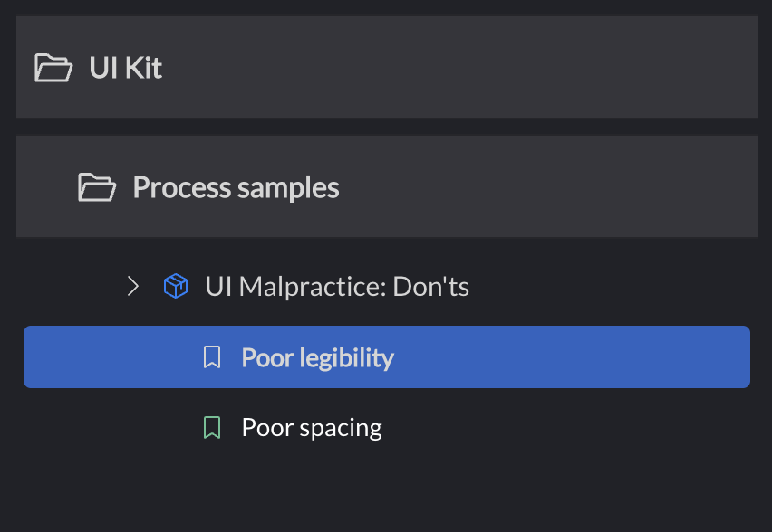

# Portfolio

Develop ClojureScript UI components in isolation in a "visual REPL". Increase
your visual bandwidth by seeing your components in various states, screen
resolutions, and other configurations simultaneously.

Portfolio brings some of the best features of
[Storybook.js](https://github.com/storybookjs/storybook) to ClojureScript, and
adds a few of its own. While Storybook.js was its starting point, Portfolio does
not aspire to feature-parity with it, and instead caters to the REPL-oriented
ClojureScript development process.

## Status

Portfolio is stable and ready to use. APIs documented in this document are final
and will not change. APIs not explicitly documented in this document, especially
those pertaining to extending and customizing the UI, may still be subject to
change.

Is Portfolio good enough that you can port over from Storybook? Probably, yes.
If you're using Storybook extensions not covered by Portfolio, open an issue.

## Show me, don't tell me

I recently presented Portfolio at London Clojurians, you can [watch it on
YouTube](https://www.youtube.com/watch?v=25JDQRFoQ_U).

## Sample


There is a [live sample](https://cjohansen.github.io/) to check out. The source
code for the sample is [also available](https://github.com/cjohansen/sasha).

## Install

With tools.deps:

```clj
no.cjohansen/portfolio {:mvn/version "2023.04.26"}
```

With Leiningen:

```clj
[no.cjohansen/portfolio "2023.04.26"]
```

## Usage

Portfolio displays your components in "scenes". A scene is a component in a
specific state. Whether that "component" is a single element, like a button, or
an entire page layout, is completely up to you. You define scenes with the
`defscene` macro:

```clj
(defscene button
  [:button.button "I am a button"])
```

At its most minimal, a scene is just a named instance of a component. Where you
require `defscene` from depends on your rendering library of choice. If you're
using [reagent](https://github.com/reagent-project/reagent), you'll `(:require
[portfolio.reagent :refer-macros [defscene]])`.

Currently these adapters are supported:

- [Reagent](https://github.com/reagent-project/reagent)
  - Older versions of React - `portfolio.reagent`
  - React versions 18+ - `portfolio.reagent-18`
- [Rum](https://github.com/tonsky/rum)
  - Older versions of React - `portfolio.rum`
  - React versions 18+ - `portfolio.react-18`
- [Dumdom](https://github.com/cjohansen/dumdom) - `portfolio.dumdom`
- React (including [Helix](https://github.com/lilactown/helix), [UIx<sup>2</sup>](https://github.com/pitch-io/uix))
  - Older versions of React - `portfolio.react`
  - React versions 18+ - `portfolio.react-18`
- DOM API - `portfolio.dom`
- HTML strings - `portfolio.html`

All these namespaces have a `defscene` macro that works the same way. Note that
Portfolio does not depend on any of these, so if you're using
`portfolio.reagent`, you must explicitly pull in `reagent` yourself.

`defscene` takes a symbol name and a component as its minimum input, but it can
also take additional key/value pairs, and an optional docstring:

```clj
(defscene name
  ;; Optional docstring
  ;; key/value pairs
  component)
```

Docstrings can contain Markdown:

```clj
(defscene empty-input
  "The `LabeledInput` component is a responsive form control"
  (LabeledInput {:label "Your name"}))
```

Scenes can take arguments and have function bodies:

```clj
(defscene name
  ;; key/value pairs
  :params {:title "Your component data here"}
  [params portfolio-opts]
  (render-component params))
```

Scenes can also use existing functions to render:

```clj
(defn render-button [data]
  [:button.button (:text data)])

(defscene reusable-fn
  :params {:text "Click the button!"}
  render-button)
```

By using `:params` and either a function body or an existing function, you allow
Portfolio to know about the scene's component data. This enables you to use
`tap>` and Portfolio's UI to interact with your component, or bind the scene to
an atom for stateful scenes. It also enables you to inspect portfolio's layout
options (background, viewport size, etc) to render the component.

Here's an example of passing an atom to your scene:

```clj
(defscene name
  :param (atom {:title "Hello world!"})
  [store portfolio-opts]
  [:h1 (:title @store)])
```

As you can see - if you pass an atom as `:params`, an atom is what is passed to
your component function. If you just want a map, that can also benefit from this
indirection, because it allows you to programmatically access component data.
The uses for this are countless, some suggestions include:

- Using Portfolio's UI to tinker with the parameter
- Power a search that finds scenes based on data

```clj
(defscene name
  :params {:title "Hello world!"}
  [params portfolio-opts]
  [:h1 (:title param)])
```

Portfolio can subscribe to multiple atoms in `:params`. If you set `:params` to
a map or a vector, Portfolio will `tree-seq` it to find all contained atoms and
re-render the scene when any of them change.

Portfolio will "humanize" the scene symbol id for a title. If you don't like the
result, you can set `:title` to override the UI title:

```clj
(defscene default-scenario
  :title "'tis the default scenario!"
  :params {:title "Hello world!"}
  [params portfolio-opts]
  [:h1 (:title param)])
```

With `:title`, this will list as `'tis the default scenario!` in the sidebar
instead of `Default scenario`.

Currently supported key/value pairs:

- `:title` - Give the scene a nice string name
- `:params` - The initial parameter passed to the component function - also
  aliased as `:param`
- `:on-mount` - A function called when the scene is initially mounted. The
  function is passed the component arguments.
- `:on-unmount` - A function called when the scene is removed from the DOM. The
  function is passed the component arguments.
- `:collection` - What collection the scene belongs to. See
  [Organizing scenes](#organizing-scenes).
- `:icon` - An icon to display instead of the default bookmark ([about icons](#scene-and-collection-icons)).
- `:selected-icon` - Specific icon to display when the scene is selected.
- `:icon-color` - The color of the scene icon.
- `:selected-icon-color` - Specific icon color for when the scene is selected.

### Starting the Portfolio UI

After you have created your scenes, start the UI:

```clj
(require '[portfolio.ui :as ui])

(ui/start!)
```

### Custom CSS

By default your scenes will render inside an iframe in a blank HTML page called
the canvas. This page has no default styling, and comes as bare as possible out
of the package. You might want to add some CSS files to the canvas, which can be
done with `ui/start!`:

```clj
(require '[portfolio.ui :as ui])

(ui/start!
  {:config {:css-paths ["/myapp/custom.css"]}})
```

Add as many CSS files as you like. If you run Portfolio with figwheel-main, CSS
files will automatically reload when changed.

### Custom Canvas HTML

If you need to make more adjustments to the canvas, such as adding meta tags,
global JavaScripts etc, you're better off providing your own canvas:

```clj
(require '[portfolio.ui :as ui])

(ui/start!
  {:config {:canvas-path "/my/custom/portfolio.html"}})
```

There are no requirements to how you format this file. Portfolio will add a div
with id `"canvas"` to it, in which it will render the scene. If there already is
an element with that id, it will be used instead, so be aware of that.

## shadow-cljs

To use Portfolio with shadow-cljs, you must ensure that Portfolio's resources
are served by the development HTTP server. Include `"classpath:public"` in your
`:dev-http` sources:

```clj
:dev-http {8080 ["public" "classpath:public"]}
```

This will serve files from `public` in your project (where presumably your
index.html and CSS files are), and resources in `public` on the classpath (e.g.
Portfolio's resources). Adjust as necessary.

### shadow-cljs + separate dev server

If you are using shadow-cljs to build the front-end and leiningen to run the dev
server separately you need to make sure that you add `classpath:public` to the
`:resource-paths` and the dependency to Portfolio to the `:dependencies` in
`project.clj`. This will then serve the necessary assets to make Portfolio work.

## Customizing the Portfolio UI

The Portfolio UI is highly customizable: The default canvas tools are all
optional, and their options can be configured to your liking. While not yet
finalized there are also APIs for you to create custom tools - locale selection,
theme selectors, and whatever else your imagination can conjure. Documentation
will be available when these APIs are considered stable.

### Background

The background tool sets a background color for your scene, and adds a class
name to the `body` element, to help your CSS choose between dark mode and light
mode. See
[`portfolio.ui.canvas.background`](./src/portfolio/ui/canvas/background.cljs)
for specifics about the default options. To default Portfolio to use dark mode
for scenes, specify `:background/default-option-id` when calling `ui/start!`:

```clj
(require '[portfolio.ui :as ui])

(ui/start!
  {:config {:background/default-option-id :dark-mode}})
```

To change the available options, use `:background/options`:

```clj
(require '[portfolio.ui :as ui])

(ui/start!
 {:config
  {:background/options
   [{:id :bright-mode
     :title "Bright mode (.bright-mode)"
     :value {:background/background-color "#f8f8f8"
             :background/body-class "light-mode"}}
    {:id :bleak-mode
     :title "Bleak mode (.bleak-mode)"
     :value {:background/background-color "#000000"
             :background/body-class "dark-mode"}}]

   :background/default-option-id :bleak-mode}})
```

### Viewport

The viewport tool sets the dimensions of the viewport your scenes are rendered
in, and can help with responsive design. The default options are auto and an
iPhone-like size. You can provide your own options if you want:

```clj
(require '[portfolio.ui :as ui])

(ui/start!
 {:config
  {:viewport/options
   [{:title "Auto"
     :value {:viewport/width "100%"
             :viewport/height "100%"}}
    {:title "iPhone 12 / 13 Pro"
     :value {:viewport/width 390
             :viewport/height 844}}]}})
```

Options can use specific pixel dimensions, percentages, or a mix. You can have
as many resolutions as you need. You can optionally control scene offset from
the viewport by adding `:viewport/padding` to either a number, or a vector with
four numbers (padding north, east, south, west).

If you just want to display all scenes in a default viewport, and don't care for
the viewport button in the toolbar, you can configure it like so:

```clj
(require '[portfolio.ui :as ui])

(ui/start!
 {:config
  {:viewport/options []
   :viewport/defaults
   {:viewport/padding [0 0 0 0]
    :viewport/width 390
    :viewport/height 844}}})
```

You can of course also combine viewport options with a default viewport.

### Grid

The grid tool displays a grid in the background of your scenes. The default is
either no grid, or a 5 by 20 pixel grid. Change this as you see fit:

```clj
(require '[portfolio.ui :as ui])

(ui/start!
 {:config
  {:grid/options
   [{:title "5 x 20px"
     :value {:grid/offset 0
             :grid/size 20
             :grid/group-size 5}}
    {:title "No grid"
     :value {:grid/size 0}}]}})
```

### Docs

The docs tool toggle documentation on and off globally. It will toggled on by
default.

### Code

The code tool toggles on and off scene code - e.g. the code in the `defscene`
body. This only works with inline components and the arguments/body form. If
your scene is created with just a reference to a function, Portfolio can't
automatically display its implementation.

### Split windows

The window splitting tool allows you to run multiple panes at once. This allows
you to view multiple versions of a scene simultaneously.

### Compare tool

The compare tool allows you to select different scenes in split panes. This way
you can not only compare different versions of the same scene, but also
different scenes.

## Organizing scenes

By default, Portfolio tries to organize your scenes into folders and packages.
It uses the namespaces of your scenes to do this, and attempts to humanize the
resulting names. You can easily provide custom names, icons, colors and sort
orders for scenes, packages and folders - or you can completely customize your
scene organization if your want.

### Customizing packages / namespaces

The default "packages" correspond to the namespaces where your scenes are
defined. If you drop a bunch of `defscene`s into `ui.components.button-scenes`,
then `ui.components.button-scenes` will be used as a "package", and its name
will be `"Button scenes"`. If you don't like this, call
`portfolio.<adapter>/configure-scenes` from the same namespace:

```clj
(ns ui.components.button-scenes
  (:require '[portfolio.reagent :as portfolio]))

(portfolio/configure-scenes
  {:title "Button"})
```

What keys can you stick in this map? Well, the following (more on icons below):

- `:title` - The title of the collection.
- `:idx` - The sorting index.
- `:icon` - An icon to display instead of the default 3D box
- `:expanded-icon` - An icon to display when the package is expanded (overrides
  `:icon`, if both are set)
- `:collapsed-icon` - An icon to display when the package is collapsed (overrides
  `:icon`, if both are set)
- `:icon-color` - The icon color. Duh.
- `:expanded-icon-color` - A more specific color for expanded packages.
- `:collapsed-icon-color` - A more specific color for collapsed packages.
- `:kind` - One of `:folder` or `:package`. Dictates the rendering style.
  Namespaces default to `:package`.
- `:default-folder-icon` - The default icon to use for folders nested under this
  collection.
- `:default-folder-expanded-icon` - The default icon to use for expanded folders
  nested under this collection. Overrides `:default-folder-icon` when set, and
  can be overridden on specific folders.
- `:default-folder-collapsed-icon` - The default icon to use for collapsed folders
  nested under this collection. Overrides `:default-folder-icon` when set, and
  can be overridden on specific folders.
- `:default-package-icon` - The default icon to use for packages nested under this
  collection.
- `:default-package-expanded-icon` - The default icon to use for expanded packages
  nested under this collection. Overrides `:default-package-icon` when set, and
  can be overridden on specific packages.
- `:default-package-collapsed-icon` - The default icon to use for collapsed packages
  nested under this collection. Overrides `:default-package-icon` when set, and
  can be overridden on specific packages.

#### Scene and collection icons

You might be wondering - "what's an icon, anyway?". Good question. An icon is
either hiccup for an SVG element, or one of the keywords in
[`portfolio.ui.icons`](./src/portfolio/ui/icons.cljs). These icons are manually
fetched from [Phosphor icons](https://phosphoricons.com/) on demand, feel free
to add more via a PR.

### Customizing folders

Folders are collections like packages. If you have scenes in
`ui.components.button-scenes`, Portfolio creates a "package" for
`ui.components.button-scenes`, and a "folder" for `ui.components`. If you
already have a `ui.components` namespace in your project, you can call
`portfolio/configure-scenes` as above to customize it. If you don't, you can
somewhat more manually configure the collection in any namespace of your liking
(e.g. the one where you start the Portfolio UI):

```clj
(require '[portfolio.data :as data])

(data/register-collection!
  :ui.components
  {:title "My loverly components"})
```

### Custom organization

If you don't like the default organization Portfolio sets up, you can create
your own arbitrarily nested organization using the two kinds of renderings
available (e.g. "folder" and "package"). These are both collections, but they
render differently.

To dictate what collection a scene belongs to, set the `:collection` keyword:

```clj
(defscene poor-legibility
  :collection :ui-malpractice
  [:div {:style {:background "#000" :color "#333"}}
    "Please don't use too little contrast"])
```

You can then define the collection using `portfolio.data/register-collection!`:

```clj
(require '[portfolio.data :as data])

(data/register-collection!
  :ui-malpractice
  {:title "UI Malpractice: Don'ts"
   :kind :folder})
```

It does not matter if you define the scene or the collection first, Portfolio
will connect the pieces. If you refer to a `:collection` that doesn't exist,
Portfolio will default the necessary pieces of information.

Collections can nest, just add `:collection` to a collection to indicate that it
belongs to another collection:

```clj
(require '[portfolio.data :as data])

(data/register-collection!
  :ui-malpractice
  {:title "UI Malpractice: Don'ts"
   :collection :process-samples
   :kind :package})

(data/register-collection!
  :process-samples
  {:title "Process samples"
   :collection :ui-kit
   :kind :folder})

(data/register-collection!
  :ui-kit
  {:title "UI Kit"
   :kind :folder})
```

This will render nested folders:



## Search

Search your scenes and collections. This feature is not enabled by default, as
it's assumed not to be very useful until you have enough content. To enable it,
create an index and pass it when you start the UI:

```clj
(require '[portfolio.ui.search :as search]
         '[portfolio.ui :as ui])

(ui/start!
 {:config
  {:css-paths ["/styles/app.css"]}
  :index (search/create-index)})
```

`create-index` returns an implementation of
`portfolio.ui.search.protocols/Index`. You can provide custom implementations of
this protocol to completely customize the search. More documentation on this
will follow.

## Try it out

You can take the Portfolio UI for a spin by cloning this repo, starting
figwheel, and then checking out [http://localhost:5995](http://localhost:5995),
which will show you all the scenes defined in [./sample/src/portfolio](the
sample project). There are also some scenes in the "mirror" build, which
demonstrates some of Portfolio's own UI components, available at
[http://localhost:5995/mirror.html](http://localhost:5995/mirror.html).

## Disabling Portfolio in production

The `defscene` macro can be placed anywhere you like - in separate files, or
inline in production code alongside the implementation being demonstrated. In
the latter case, you probably want to strip the macros from you production
builds. It is assumed that most people will put Portfolio scenes in a separate
directory that can easily be excluded from production builds, so Portfolio is
enabled by default. To disable it in your build, use any of the following two
options.

### Adding a compiler option

Add `:portfolio/enabled? false` to your ClojureScript compiler options:

```clj
{:main "myns.prod"
 :optimizations :advanced
 :source-map true
 :portfolio/enabled? false}
```

### Using a Closure define

Your second option is to set the `portfolio.core/enabled` [Closure
define](https://clojurescript.org/reference/compiler-options#closure-defines) to
`false`. Closure defines can be set several ways, see the link.

## Contributions

Yes please! Feel free to contribute more framework adapters, UI extensions or
whatever. Please open an issue or a draft PR to discuss larger changes before
pouring too much work into them, so we're sure we're one the same page.

- @rome-user added [support for pure React components and Helix](https://github.com/cjohansen/portfolio/pull/2).
- @BorisKourt and @thheller helped with shadow-cljs support.
- @brandonstubbs React 18-related features.
- @elken made some visual improvements

## Wishlist

Some features and fixes that are likely to be explored in the close future:

- Improved 404 page when namespaces disappear
- Search in mobile view
- Better error-handling for things like `:on-mount`
- Better first use experience: display some documentation when there are no
  scenes
- Add a scratchpad of sorts for rendering from the REPL
- Generate scenes from a component and specs

## Changelog

### 2023.04.26

- Now works properly with advanced compilation mode in shadow-cljs (e.g.
  production builds)
- Add back a missing close icon
- Remove some unnecessary scrollbars in the UI
- Don't trip on scenes with multiple lines of code in their body
- Render compare mode menus with the proper background
- Slightly improved code formatting for scene code

### 2023.04.21

#### UI improvements

- Many improvements to the UI, big and small
- Portfolio now works well on mobile devices
- Split panes can be resized with drag'n'drop
- Persist the state of tools like background and viewport
- Portfolio's console logs are disabled by default
- Added a small intro page for new setups when there are no scenes

#### Compare mode

When running Portfolio in split mode, you can select specific scenes for either
of the panes. This way you can not only compare different versions of the same
scene, but compare different scenes to each other.

#### Documentation and code

Scenes and collections can now have Markdown docstrings. These render above the
scenes, and there is a new toolbar button to toggle their display on or off.

Portfolio can now also optionally display the scene code. This is toggled off by
default, and can be enabled by clicking the brackets button in the toolbar.

#### Organization improvements

There are some improvements to Portfolio's default organization into packages
and folders, and particularly their interaction with your custom collection
configuration.

You can now specify default scene icons for collections.

#### Improved atom param support

Portfolio now watches all atoms in `:param`. This means you can set `:param` to
e.g. a map or a vector, put several atoms inside (arbitrarily nested), and
Portfolio will re-render the scene whenever any of them change. To reflect that
`:param` is no longer necessarily just one thing, it has also been aliased as
`:params`.

#### Search

Add search, including APIs for customizing indexing, searching, and result
preparation.

### 2023.04.05

Added [new APIs for organizing scenes](#organizing-scenes) in the sidebar.

## License

Copyright © 2022-2023 Christian Johansen

Distributed under the Eclipse Public License either version 1.0 or (at your
option) any later version.
